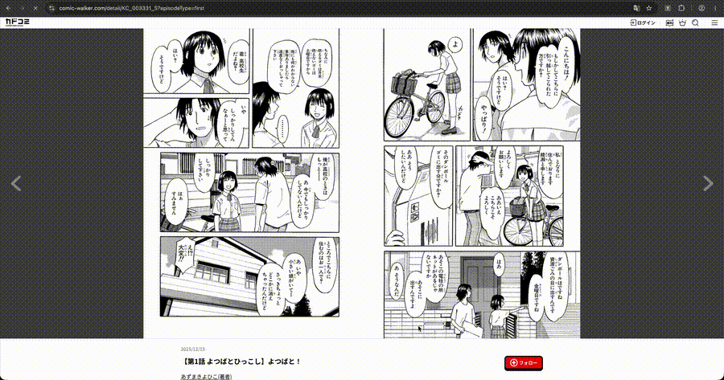

# Yomi Web
A web OCR tool to convert images to text, inspired by [Mokuro](https://github.com/kha-white/mokuro), [YomiNinja](https://github.com/matt-m-o/YomiNinja) and [Cloe](https://github.com/blueaxis/Cloe).

## About

This project is a tool I developed around my own workflow for learning Japanese through manga. I primarily use Yomitan to look up unfamiliar words, build vocabulary, and support reading comprehension, one thing that I have found tedious when reading japanese manga specifically is the whole workflow of image to OCR to translation.

I considered several existing tools, including Mokuro and YomiNinja. Both solve similar problems well, but neither quite fit how I read manga. Mokuro relies on local files, where I primarily read directly from websites like SJP. YomiNinja covers most of what I need and offers more features, including multiple OCR engines, but it's designed more for general purpose OCR, with features like whole-screen extraction and requiring custom Yomichan integration.  

Yomi Web instead focuses on a lighter, browser based workflow, allowing users to select and extract only the regions they need without processing the entire screen. Since it runs directly in the browser, tools like Yomitan integrate seamlessly.   

I mainly use this tool locally on my MacBook Air, so development has so far been focused around macOS and the Apple ecosystem. Some implementation decisions and platform-specific features may currently favour macOS, but the plan is to broaden the scope to windows and linux too.

- NOTE THAT THIS PROJECT IS CURRENTLY STILL IN DEVELOPMENT.

## Usage

- The text sits on a overlay layer above the webpage as html elements, you can easily use dictionaries such as [Yomitan](https://yomitan.wiki/) to look up words.
- Yomi Web extracts text as DOM elements on the page, Yomitan and other browser dictionaries should be able to integrate seamlessly with it.



Ctrl/Cmd + Shift + O       |  Select region
:-------------------------:|:-------------------------:
  |  
- Then wait for the OCR to process the image.
- `Ctrl/Cmd + Shift + X` erases the processed texts.
- `Ctrl/Cmd + Shift + Y` recaptures the previously captured region.
- From here you can use Yomitan or other tools you have;


## Requirements

You will need:
- Python 3.10–3.12
- npm
- Chrome / Chromium or Firefox

## Pipeline

- The manga text extraction uses the following pipeline;
```
Screen Selected Image -> Comic Text Detector -> Manga OCR -> Displayed Text
```

## Install

- Three different types of models can be installed depending on the input size of the CTD OCR, for day-to-day use, the 768 model is recommended and is what this application comes with my default, see benchmarking below for more details.
- To change the model input size, drag the desired model into your backend files under models and update the `detector.py` input size and model path parameters.
- Currently a install is still in the works, Check back later,

## Development
1. Clone the repository
```
git clone <repository-url>
cd <repository-name>
```
### Backend Setup
2. Navigate to backend
```
cd ocr
```
3. Create a python venv
- On macOS/Linux;
```
python3 -m venv .venv
source .venv/bin/activate
```
- On windows;
```
python -m venv .venv
.venv\Scripts\activate
```
4. Install python dependencies
```
pip install -r requirements.txt
```
- The backend primarily uses;
```
FastAPI
Uvicorn
Pillow
Manga OCR
NumPy
OpenCV
PyTorch
TorchVision
```
5. Start the backend
```
uvicorn main:app --reload
```
- Note this may take a while in the first instance as Manga OCR will need to install 400MB of data.
### Frontend Setup
6. Navigate to frontend;
```
cd web-extension
```
7. Install dependencies and run dev mode;
```
npm install
npm run dev
```
8. Add extension
- On chrome, go to extensions, load unpacked and load the chrome-mv3-dev folder.

## Performance/Benchmarking
- My understanding of machine learning and OCR models is still relatively limited, so some of my explanations or assumptions regarding model behaviour and performance may not be entirely accurate. Corrections and suggestions are welcome.
- The pipeline requires running two fairly large ML models locally, Comic Text Detector is used for detecting the bounding boxes of the text in a page and Manga OCR is used to extract the text in the bounding boxes.
- On a M4 macbook air, the main performance bottleneck lies in the detection using Manga OCR to extract characters out of the bounding boxes, an initial benchmark using the original model, on average, extracting bounding boxes take around 1.5s sec while extracting a single sentence takes around 0.1 sec, collectively for an average of 15 boxes per image for a page of manga, this adds up to be quite significant.
- As such, text detection can be coupled with different OCR models which will be added in a future update, so far, Apple's Vision framework provides OCR detection with hardware acceleration, provides some performance improvements, a method for windows is still in the works.  

- Tweaking the input size parameter on the CTD model can be managed in `detector.py` (credit to [Comic Text Detector](https://github.com/dmMaze/comic-text-detector)). The original `onnx` file model uses a fixed input size of 1024, which produces the baseline performance shown above.
- The `pytorch` model allows tweaking input size parameters but doesn't provide more reliable performance enhancements compared to the `onnx` version due to the pytorch runtime overhead.
- To retain the performance benefits of ONNX while experimenting with different input resolutions, I also exported additional ONNX models with fixed input sizes of 768 and 640.

Machine: Apple M4 (average across 6 pages)
| Input Size | CTD time | MangaOCR time | Blocks |
| --- | --- | --- | --- |
| 1024 | 1.497s | 0.902s | 9.67 |
| 768 | 0.787s | 0.930s | 9.33 |
| 640 | 0.543s | 0.929s | 9.5 |

- I have found the 768 model currently provides the best overall balance between detection accuracy and performance. It produced results very similar to the original 1024 model while reducing CTD inference time from approximately 1.50 s to 0.79 s.
- The 640 model is faster again, reducing CTD inference time to approximately 0.54 s, and still performs well on many pages. However, its reliability is more dependent on page layout, text size, and image quality, with smaller or more difficult text regions being more likely to be missed.
- Interestingly, changing the CTD input resolution has very little effect on MangaOCR inference time. This is expected because the input size primarily affects the text-detection stage; MangaOCR still processes the resulting cropped text regions independently.
- For day-to-day use, 768 is the recommended default, while 640 is useful when prioritising speed and 1024 can be used when maximum detection reliability is preferred.

| CTD Input Size 768 | CTD Input Size 640 |
:-------------------------:|:-------------------------:
 | 

## Future Updates

- I would like to add the ability to tweak the text extraction OCR in the future, so far, it just uses Manga OCRS's fixed settings, I will also add the ability to choose between using Apple's Vision OCR as well.
- I've heard that adding batch processing instead of individual passes is much better for ML models, I'll add this in a future update for text extraction.

## OCR Tools
Manga OCR - [manga ocr](https://github.com/kha-white/manga-ocr)  
Comic Text Detector - [comic text detector](https://github.com/zyddnys/manga-image-translator/releases/tag/beta-0.3)  
https://github.com/zyddnys/manga-image-translator/releases/tag/beta-0.3
